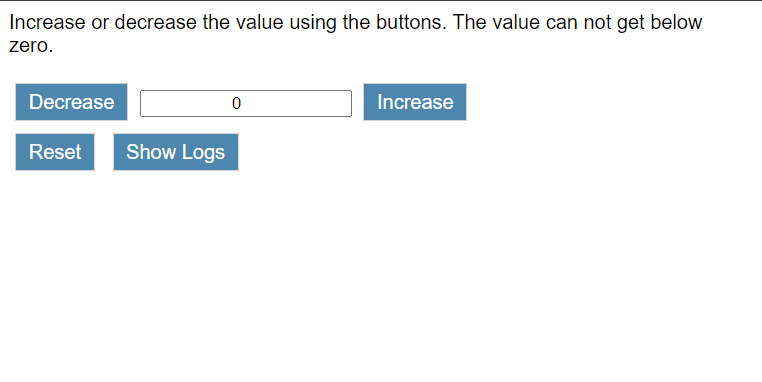

# Lecture 18 Practice
In this practice problem we will build a web page that utilizes HTML events to call JavaScript functions that will either increment or decrement a value.  We will also record what the user's actions are on the page in an array and then display those logs when requested.  

## Implementation

### Initial Page Load
The page will render with three rows of elements.
 * Row 1:  Text informing the user on the basics of the web page and that the the value can't go below zero.
 * Row 2:  This row will consist of two buttons and an input field.  The first element will be a button that is used to decrease the value.  The second element is an input element that will hold the value and only allows numbers.  The value should be defaulted to zero.  The third element is another button that will increase the value.
 * Row 3:  On this row there will be two buttons.  The first button resets the value to zero.  The second button causes the log viewing section to become visible.  

With the logs displayed

### Functional Requirements
1. Decrease button should decrease the value in the input box by one unless that would cause the value to be less than zero.  If the value would be less than zero then set the value to zero.
2. Increase button should increase the value in the input box by one, no restrictions.
3. Input box will let the user entere their own value.  If the value is less than zero then the value will get reset to zero in the input box.  If the user then clicks the increase or decrease buttons the behavior of those buttons will continue only now from the new value.
4. Reset button will reset the input value to be set back to zero.  It will also hide the logs section if it is visible.
5. Show Logs button will cause the logs section to be displayed.  Each action logged will be displayed on its own line.
6. Any action taken by the user, clicking the buttons or manually entering a value in the input box will be recorded in an array for display.

### Styling
In the example solution the buttons have been customized with font, color, border, and margins.  Feel free to experiment with CSS to give your page a unique look and feel.

## Demonstration

